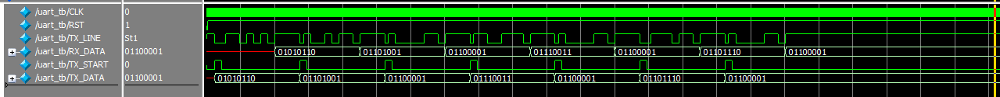

---

# UART Module in Verilog

## 📦 Overview

This project provides a simple UART (Universal Asynchronous Receiver Transmitter) module written in Verilog, along with a testbench to simulate sending and receiving ASCII characters.

- **UART baud rate:** 9600 bps  
- **Clock frequency:** 50 MHz  
- **Simulation timescale:** `1us / 1ns`

## 📁 Files Included

- `uart_tb.v` — Testbench to simulate UART communication  
- `uart.v` — UART module with both TX and RX functionality  
- `README.md` — This documentation file

---

## 🔧 Parameters

| Name         | Description                         | Default     |
|--------------|-------------------------------------|-------------|
| `CLK_FREQ`   | Clock frequency in Hz               | 50,000,000  |
| `BAUD`       | UART baud rate                      | 9600        |
| `BAUD_DIV`   | Internal: Clock cycles per bit      | Auto-calculated (`CLK_FREQ / BAUD`) |

---

## ⏲ Timescale

```verilog
`timescale 1us / 1ns

- **Time unit:** 1 µs  
- **Time precision:** 1 ns
```
This makes waveform visualization easier for baud-rate-level signals (like 104.167 µs per bit at 9600 bps).


## 🧺s Testbench Behavior

The testbench does the following:

1. Instantiates two UART modules (`uartTX`, `uartRX`)
2. Connects TX of `uartTX` to RX of `uartRX`
3. Sends the characters of the string `"Viasana"` from TX to RX
4. Prints the received characters to the console using `$monitor`

### Output
If simulation is correct, the monitor should display:

```
V
i
a
s
a
n
a

```

## 🛄 How UART Transmit Works

- `TX_START` is pulsed high for 1 bit duration to begin transmission.
- Data is shifted out with 1 start bit (`0`), 8 data bits (LSB first), and 1 stop bit (`1`).

## 🛅 How UART Receive Works

- Waits for start bit (`0`)
- Samples data at center of each bit using baud tick
- Stores 8 bits into buffer and updates `RX_DATA`

---


### 🖼️ Example UART Waveform




---

## 🔁 Design Notes

- TX and RX share the same clock and baud logic
- Simple FSMs for TX (`tx_state`) and RX (`rx_state`)
- Bit counters reset for each new transmission or reception
- Simulation uses `#(BIT_DURATION*11)` delay to wait for full frame (start + 8 data + stop bits)

---

## 🧑‍💻 Author

Thạch ViaSaNa  

---

